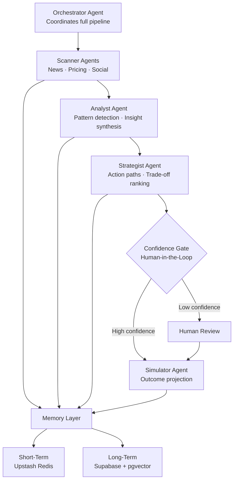

# Vigil

> A continuously running multi-agent market intelligence system — real-time signal 
> ingestion, LLM-powered analysis, confidence-gated human-in-the-loop, and 
> strategic recommendations delivered in minutes, not days.

---

## What is Vigil?

Most competitive intelligence tools are static dashboards — you pull data manually, 
interpret it yourself, and act on insights that are already hours old. Vigil replaces 
that workflow with a continuously running agentic pipeline that watches markets, scores 
signals, generates strategic options, and only escalates to a human when confidence 
is low enough to warrant it.

The architecture is grounded in **BDI (Belief-Desire-Intention)** agent design — each 
agent maintains beliefs about the current market state, pursues a specific goal, and 
commits to actions within its scope. The orchestrator coordinates the pipeline without 
micromanaging individual agents.

---

## How it works

### The Pipeline



### Agent Roles

**News Scanner** fetches and parses live market signals via Currents API — product 
launches, sentiment shifts, competitive moves.

**Pricing Scout** pulls real-time financial and pricing data via Finnhub, tracking 
market positioning signals.

**Signal Scorer** filters the combined feed — noise is dropped, high-value signals 
are ranked and forwarded to the analyst.

**Analyst** synthesizes scored signals into structured insights with confidence scores 
and reasoning chains.

**Strategist** generates multiple ranked action paths with explicit trade-offs — not 
a single recommendation but a decision surface.

**Simulator** projects outcomes for each strategic option before any action is taken — 
giving decision-makers a preview of consequences.

**Confidence Gate** sits between the Strategist and Simulator. High-confidence 
pipelines run end-to-end autonomously. Low-confidence decisions surface to a human 
before proceeding. This isn't a UI feature — it's an architectural constraint baked 
into the pipeline.

### Memory Layer

Short-term memory (Upstash Redis) holds the active session context — signals seen, 
insights generated, decisions made in the current run. Long-term memory (Supabase + 
pgvector) persists patterns and outcomes across runs, enabling the system to improve 
its signal scoring and strategy ranking over time through retrieval-augmented generation.

---

## Stack

| Layer | Technology |
|---|---|
| Frontend | React 19, Vite, TypeScript, Tailwind CSS |
| State Management | Zustand |
| Pipeline Visualization | React Flow |
| Backend | Python, FastAPI, Uvicorn |
| Agent Orchestration | LangGraph |
| LLM Inference | Groq (reasoning), Cerebras (high-throughput) |
| News Data | Currents API |
| Market Data | Finnhub API |
| Short-Term Memory | Upstash Redis |
| Long-Term Memory | Supabase + pgvector |
| Real-Time Comms | WebSockets |

---

## Running locally

**Prerequisites:** Python 3.11+, Node.js 18+

```bash
# Clone the repo
git clone https://github.com/neswanths/vigil.git
cd vigil

# Backend
cd backend
pip install -r requirements.txt
cp .env.example .env   # fill in your API keys
uvicorn main:app --reload

# Frontend
cd ../frontend
npm install
npm run dev
```

Required API keys (add to `backend/.env`):
- `GROQ_API_KEY`
- `CEREBRAS_API_KEY`
- `CURRENTS_API_KEY`
- `FINNHUB_API_KEY`
- `SUPABASE_URL`, `SUPABASE_ANON_KEY`, `SUPABASE_SERVICE_ROLE_KEY`
- `UPSTASH_REDIS_REST_URL`, `UPSTASH_REDIS_REST_TOKEN`

Set `MOCK_MODE=true` to run without live API calls.

---

## Project Structure
'''

vigil/
├── backend/
│   ├── agents/
│   │   ├── graph.py           # LangGraph pipeline definition
│   │   ├── fast_pipeline.py   # Optimized pipeline execution
│   │   ├── news_scanner.py    # Currents API ingestion
│   │   ├── pricing_scout.py   # Finnhub market data
│   │   ├── signal_scorer.py   # Signal filtering and ranking
│   │   ├── analyst.py         # Insight synthesis
│   │   ├── strategist.py      # Action path generation
│   │   └── fault_tolerance.py # Pipeline resilience
│   ├── memory/                # Short and long-term memory management
│   ├── routers/               # FastAPI REST and WebSocket endpoints
│   ├── models/                # Pydantic data models
│   └── config.py              # Environment and API configuration
├── frontend/
│   ├── src/
│   │   ├── components/        # UI elements — cards, modals, action views
│   │   ├── store/             # Zustand WebSocket state management
│   │   ├── pages/             # Dashboard, Answer View, Simulation View
│   │   └── lib/               # API clients and utilities
└── README.md

---
'''

## Current Status

The full pipeline — signal ingestion, 
scoring, analysis, strategy generation, and confidence-gated HITL — is implemented 
end-to-end. The system prompts are tuned for the consumer electronics / smartphone 
industry but the architecture is domain-agnostic.

**What's next:**
- Persistent feedback loop for strategy outcome tracking
- Multi-tenant mission management
- Production deployment with rate limit handling

---

## License

MIT 
